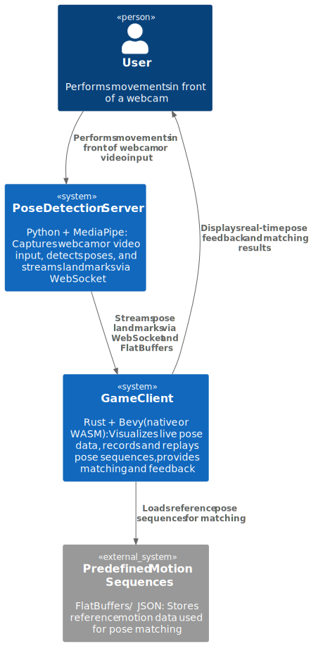

# 3. System Scope and Context

## 3.1 System Context

The system enables real-time, movement-based interaction using pose landmarks detected from live 
camera input or prerecorded video. It is designed as a flexible, modular architecture that supports 
multiple deployment scenarios, enabling different types of motion-based experiences.

### 3.1.1 Purpose and Scope

The system provides a core framework for:
- Live pose landmark detection from webcam or video
- Real-time visualization of detected poses
- Recording of detection sequences for later playback
- Comparison of live movement against predefined motion sequences (planned feature)
- Display of visual feedback and performance scoring (planned feature)

The architecture is intended to be **platform-agnostic** and **extensible**, supporting:
- Games
- Fitness and rehabilitation applications
- Interactive installations
- Educational and training systems

### 3.1.2 Key Concepts

- **Input:** Webcam or video file → pose landmarks via MediaPipe
- **Processing:** Pose data streamed into a visualization & interaction client
- **Matching:** Live pose compared to reference motion sequences (planned)
- **Output:** Real-time visualization and feedback to user
- **Storage:** Record and save detected sequences for replay and analysis

### 3.1.3 Architecture Principles

- The **Game Client** is the central runtime application, implemented in Rust with Bevy (WASM capable).
- A pluggable `DetectionProvider` abstraction allows the Game Client to support multiple sources of 
  pose data:
    - Current: Python Pose Detection Server over WebSocket + FlatBuffers
    - Planned: WebSocket/WebRTC bridge to JS browser API
    - Planned: iOS/Android mobile controller with onboard detection
    - Planned: Embedded pose detection sources
- The Game Client architecture is ECS-based, with clear separation of pose data, visualization, and 
  game logic.
- The architecture supports deployment in:
    - Desktop standalone
    - Browser (WASM)
    - Hybrid setups with external pose detection sources

### 3.1.4 Current and Planned Deployment Scenarios

| Scenario                      | Pose Source                  | Visualization Client                       |
|-------------------------------|------------------------------|--------------------------------------------|
| Desktop Development           | Python Pose Detection Server | Game Client (Rust + Bevy)                  |
| Browser-based (future)        | MediaPipe JS                 | Game Client (Rust + Bevy WASM)             |
| Mobile App as Controller      | iOS/Android App with Pose    | Game Client (Rust + Bevy WASM or native)   |
| Embedded Device (future)      | C++ Pose Detection Service   | Game Client on separate device or embedded |

### 3.1.5 C4 Level 1 Diagram (System Context Diagram)

### 3.1.6 Environment Notes

- The current prototype uses a **Python-based Pose Detection Server** with WebSocket and FlatBuffers.
- The Game Client is the **client** in the network model and owns game logic and visualization.
- The system is designed to gracefully evolve toward **direct JS → WASM bridges** and **mobile controller models**.
- Future optimizations will address latency, transport flexibility, and multi-platform support.
