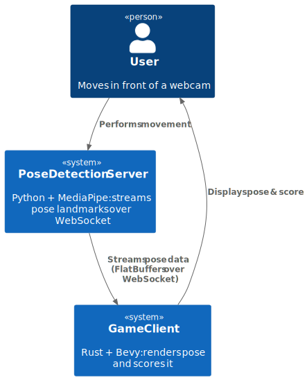

# 3. System Scope and Context

## 3.1 System Context

The system compares and visualizes human pose landmarks from two sources: live input via WebSocket and prerecorded sequences from a file. It renders both with Bevy and computes a normalized similarity score per frame.

### 3.1.1 Purpose and Scope

The system supports:

- Live pose input via MediaPipe streamed over WebSocket.
- Playback of recorded pose sequences synchronized with audio.
- Visualization of pose landmarks and skeletal structure.
- Real-time scoring of similarity between live and recorded pose frames.

### 3.1.2 Key Concepts

- **Live Pose:** Frame data received from an external Python-based pose server.
- **Reference Pose:** Frame data loaded from a JSON sequence.
- **PoseScore:** A normalized score comparing live and reference poses.
- **LandmarkFrame:** Timestamped pose data used across systems.
- **Visualization:** Bevy-based rendering using gizmos for points and lines.

### 3.1.3 Architecture Principles

- Implemented in Rust using Bevy ECS and Kira audio.
- WebSocket frame reception runs in a separate Tokio thread.
- Python pose server is spawned by the game client.
- No abstraction layers or traits — direct system-to-component updates.
- Pose comparison is position- and scale-invariant.

### 3.1.4 Current and Planned Deployment Scenarios

| Scenario             | Pose Source                  | Visualization Client     |
|----------------------|-------------------------------|---------------------------|
| Desktop              | Python Pose Server (WebSocket) | Bevy Native (Rust)        |
| Web (planned)        | MediaPipe via JS/WebRTC       | Bevy WASM                 |
| Mobile Controller    | (future)                      | Bevy Native/WASM          |

### 3.1.5 C4 Level 1 Diagram (System Context Diagram)

### 3.1.6 Environment Notes

- Live pose frames are streamed using FlatBuffers over WebSocket.
- The `Playable` entity represents the live user.
- The `NonPlayable` entity plays the prerecorded sequence.
- Audio timing controls playback synchronization.
- All pose logic is in ECS systems without intermediate traits or plugins.

---

