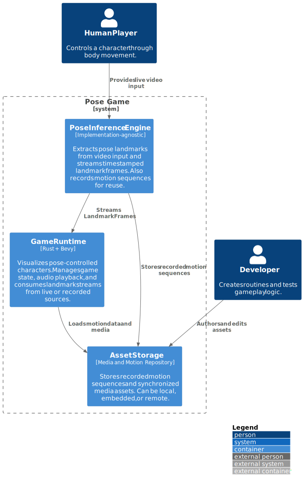
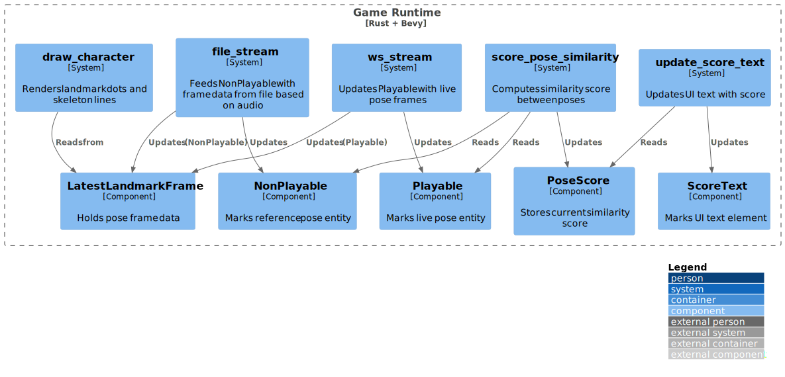

## 5. Building Block View

### 5.1 Whitebox Overall System (Container View)

The system consists of two primary containers and a modular detection pipeline:

---

#### 🎮 Game Client (Rust + Bevy)

- Visualizes human pose landmarks in real time.
- Receives pose data via **WebSocket** using a pluggable `DetectionProvider` interface.
- Uses Bevy’s ECS to manage state and rendering.
- Updates the scene based on new pose frames.
- Architecture supports alternative data sources (e.g., browser JS, iOS, embedded).
- Ready to integrate pose comparison and scoring.
- Records detection results for playback.

---

#### 📡 Pose Detection Server (Python)

- Captures video input using a webcam or video file.
- Uses MediaPipe to extract human pose landmarks.
- Serializes pose data using FlatBuffers and sends it over **WebSocket**.
- Includes `video_time_ms` for playback precision.
- Designed to be replaced by alternative detection endpoints (e.g. iOS app, JS app, embedded).

---

#### 🔁 Modular Detection Interface

- The game client includes a `DetectionProvider` trait.
- Current implementation uses `ws::FramedPayloadStream` with an async channel.
- Future implementations may pull directly from JavaScript (browser), mobile app, or hardware devices.

---

#### 💾 Reference Pose Storage (Planned)

- Will store predefined motion sequences in FlatBuffers format.
- Loaded at runtime for pose comparison and scoring.
- Playback controller replays stored sequences into ECS.

---

#### Technologies

| Container             | Technology              | Protocol     | Notes                                       |
|-----------------------|-------------------------|--------------|---------------------------------------------|
| Game Client           | Rust, Bevy, WebAssembly | WebSocket + FB | Browser-ready. Modular source architecture. |
| Pose Detection Server | Python, MediaPipe       | WebSocket + FB | To be replaced in production variants.      |
| Pose Data Format      | FlatBuffers             | —            | Shared between live and recorded input.     |

---

#### System Container Diagram (C4 Level 2)

---

### 5.2 Game Client Component View

The Game Client is structured as a set of ECS-based systems and modular interfaces.

#### Key Components

- **PayloadStream**
  - Trait defining the interface for any pose data source.
  - Implemented via `ws::FramedPayloadStream` (WebSocket transport).
  
- **DetectionProvider**
  - Wraps an async `mpsc::Receiver<DetectionResult>`.
  - Polled every frame to update internal state.

- **Detection Resource**
  - Holds the latest `DetectionResult`.
  - Updated each frame via `Detection::system_update()`.

- **Skeleton Renderer**
  - Updates Bevy entities based on landmark indices.
  - Draws bones and markers via gizmos.

- **RecordingBuffer**
  - Records streamed `DetectionResult`s with `video_time_ms` when enabled.
  - Output saved to FlatBuffers or JSON for reuse.

- **PlaybackController**
  - Replays a recorded sequence into the ECS with accurate timing.
  - Supports pausing, seeking, and synchronized visualization.

- **PoseMatcher** (Planned)
  - Compares the current live detection to the playback pose.
  - Calculates a similarity score (0–100%) based on landmark distance.

---

#### Container Component Diagram: Game Client (C4 Level 3)

