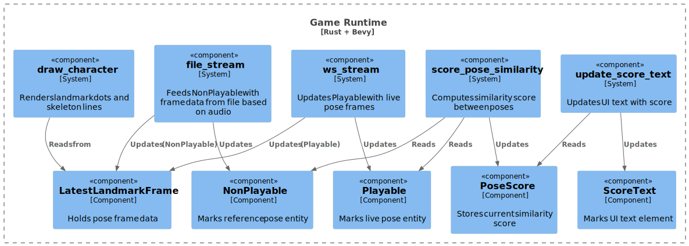

## 5. Building Block View

### 5.1 Whitebox Overall System (Container View)

---

#### 🎮 Game Client (Rust + Bevy)

- Starts the Python server with `start_inference()`.
- Reads prerecorded sequence from JSON into `Sequence` resource.
- Spawns a WebSocket listener to stream pose frames into a `Playable` entity.
- Spawns a `NonPlayable` entity to play the reference sequence using audio timing.
- Compares pose landmarks and calculates similarity in `score_pose_similarity`.
- Renders points and bones for both poses using gizmos.
- Displays the similarity score with `Text` UI.

---

#### 📡 Pose Detection Server (Python)

- Uses MediaPipe to detect pose landmarks from webcam input.
- Streams pose frames via WebSocket as FlatBuffers.
- Started from within the game client and auto-terminated on exit.

---

### 5.2 Game Client Component View

#### Key Components

- `LatestLandmarkFrame`: Holds the current frame for an entity.
- `Playable`: Marks the live input entity.
- `NonPlayable`: Marks the reference (playback) entity.
- `PoseScore(f32)`: Component holding a similarity score.
- `ScoreText`: Marks a `Text` UI displaying the score.
- `Sequence`: Resource holding the landmark sequence as `VecDeque<LandmarkFrame>`.
- `LandmarkFrameReceiver`: Receiver for incoming WebSocket pose frames.
- `AudioHandle`: Reference to the currently playing audio instance.

#### Key Systems

- `setup`: Spawns UI, camera, and landmark entities.
- `file_stream`: Feeds the `NonPlayable` entity frames from file based on audio playback time.
- `ws_stream`: Updates `Playable` with latest live pose from WebSocket.
- `draw_character`: Renders points and bones per entity using gizmos.
- `score_pose_similarity`: Computes score by normalizing and comparing poses.
- `update_score_text`: Displays the current score as a `Text` overlay.

---

### System Container Diagram (C4 Level 2)

---

### 5.2 Game Client Component Diagram (C4 Level 3)

