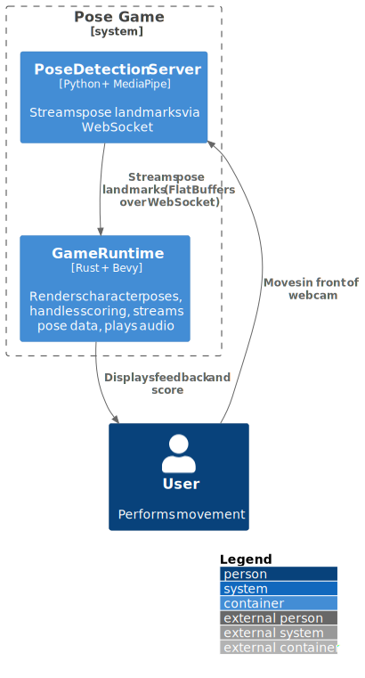

## 5. Building Block View

### 5.1 Whitebox Overall System (Container View)

The system consists of two primary containers and a modular detection pipeline:

---

#### 🎮 Game Client (Rust + Bevy)

- Visualizes human pose landmarks in real time.
- Receives pose data via TCP using a pluggable `DetectionProvider` interface.
- Uses Bevy’s ECS to manage state and rendering.
- Updates the scene based on new pose frames.
- Architecture supports alternative data sources (e.g., browser JS, iOS, embedded).
- Ready to integrate pose comparison and scoring.

---

#### 📡 Pose Detection Server (Python)

- Captures video input using a webcam.
- Uses MediaPipe to extract human pose landmarks.
- Serializes pose data using FlatBuffers and sends it over TCP.
- Designed to be replaced by alternative detection endpoints (e.g. iOS app, JS app, embedded).

---

#### 🔁 Modular Detection Interface

- The game client includes a `DetectionProvider` trait.
- Current implementation is `TcpDetectionProvider`, wrapping an async mpsc receiver.
- Future implementations may pull directly from JavaScript (browser), mobile app, or hardware devices.

---

#### 💾 Reference Pose Storage (Planned)

- Will store predefined motion sequences in FlatBuffers format.
- Loaded at runtime for pose comparison and scoring.

---

#### Technologies

| Container             | Technology              | Protocol     | Notes                                       |
|-----------------------|-------------------------|--------------|---------------------------------------------|
| Game Client           | Rust, Bevy, WebAssembly | TCP + FB     | Browser-ready. Modular source architecture. |
| Pose Detection Server | Python, MediaPipe       | TCP + FB     | To be replaced in production variants.      |
| Pose Data Format      | FlatBuffers             | —            | Shared between live and recorded input.     |

#### System Container Diagram (C4 Level 2)

### 5.2 Game Client Component View

The Game Client is structured as a set of ECS-based systems and modular interfaces.

#### Key Components

- **DetectionProvider**
  - Trait defining the interface for any pose data source.
  - Implemented via TCP channel for now.
  
- **Detection Resource**
  - Wraps a `DetectionProvider`.
  - Updated each frame via `Detection::system_update()`.
  - Holds the latest `DetectionResult`.

- **Render Pipeline**
  - Uses Bevy entities tagged with `LandmarkIndex` to represent joint markers.
  - `Skeleton::position_update()` updates transforms and draws bones via gizmos.
  - Render logic is decoupled and 2D-optimized.

- **Network Forwarder**
  - Runs in a background Tokio task.
  - Parses FlatBuffers over TCP and forwards results via an mpsc channel.

- **Startup Systems**
  - Set up camera, spawn initial landmark sprites, load detection provider.

#### Future Extensions

- Pose matching and scoring system based on `DetectionResult`.
- UI components for feedback, level control, or debugging.
- Additional detection providers (e.g., JS or mobile bridge).

### Container Component Diagram: Game Client (C4 Level 3)

