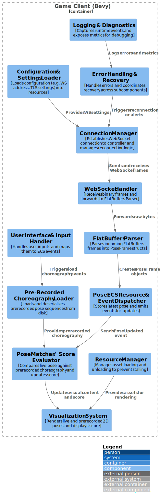

# Building Block View
## Game Client (Bevy) Subcomponents

1. **Connection Manager**  
   - Establishes and maintains a WebSocket connection to the Pose Controller.  
   - Handles reconnection logic (exponential back-off, error handling).  
   - Exposes a simple API (`connect()`, `disconnect()`, `send(bytes)`, `on_receive(callback)`).

2. **WebSocket Handler**  
   - Wraps a low-level WebSocket client (e.g. `tungstenite` or browser’s `WebSocket`).  
   - Listens for incoming binary frames; forwards raw bytes to the FlatBuffers Parser.  
   - Queues outbound messages (if any) for the Connection Manager to send.

3. **FlatBuffers Parser**  
   - Takes raw `&[u8]` from the WebSocket Handler and attempts to parse a FlatBuffers buffer.  
   - Parses 2D landmark data (e.g., `(x, y)` coordinates) from the `PoseFrame` table.  
   - Identifies the root table (by inspecting the `messageType` field).  
   - Dispatches a `PoseFrame` struct containing 2D landmarks or other message types.  
   - Exposes parsed structs (e.g. `PoseFrame { timestamp, landmarks_2d }`) to downstream systems.

4. **Pose ECS Resource & Event Dispatcher**  
   - Receives parsed `PoseFrame` objects and stores the latest 2D pose in an ECS resource  
     (e.g. `LatestPose2D`).  
   - Emits an ECS event (`PoseUpdated2D`) for systems that react immediately to new data  
     (e.g., renderer, matcher).

5. **Pre-Recorded Choreography Loader**  
   - On game start or level load, reads stored 2D pose sequences (FlatBuffers files) from disk or bundle.  
   - Deserializes into a time-ordered collection of `PoseFrame` (2D) for comparison.  
   - Stores this sequence in an ECS resource (e.g. `Choreography2D { frames: Vec<PoseFrame> }`).

6. **Pose Matcher / Score Evaluator System**  
   - Subscribes to both `LatestPose2D` updates and the loaded `Choreography2D` resource.  
   - Computes a 2D similarity metric (e.g. Euclidean distance in the plane) against the corresponding  
     reference frame.  
   - Stores the current score in an ECS resource (e.g. `LatestScore`), possibly raising an event  
     (`ScoreUpdated`).

7. **Visualization System (Bevy Renderer)**  
   - Renders the live 2D pose (from `LatestPose2D`) as a skeleton overlay in a 2D scene.  
   - Renders the pre-recorded 2D pose (from `Choreography2D`) side-by-side or in a split view.  
   - Displays the current similarity score (`LatestScore`) as HUD text or UI element.  
   - Uses Bevy’s 2D rendering primitives (sprites, lines) rather than full 3D meshes.

8. **User Interface & Input Handler**  
   - Captures user inputs (e.g. start/stop, level selection, replay).  
   - Maps UI actions to ECS events (e.g. `StartGame`, `LoadChoreography(level_id)`).  
   - Interfaces with a menu or HUD built using Bevy UI widgets.

9. **Configuration & Settings Loader**  
   - On startup, reads configuration (e.g. controller address, port, TLS settings) from a  
     TOML/JSON file.  
   - Exposes settings via a resource (e.g. `Config { ws_address, port, use_tls, ... }`) to all subsystems.

10. **Logging & Diagnostics**  
    - Captures runtime events (connection status, parsing errors, performance metrics).  
    - Writes logs to console or a file (configurable via `Config`).  
    - Exposes metrics (e.g. frames-per-second, average latency) to a debug overlay if enabled.

11. **Error Handling & Recovery**  
    - Centralized component that tracks errors from Connection Manager, Parser, or Matcher.  
    - Emits ECS events (e.g. `ConnectionLost`, `ParseError`) to trigger UI prompts or automatic  
      recovery steps.  
    - Coordinates with Connection Manager to retry or escalate fatal faults.

12. **Resource Manager**  
    - Manages asset loading/unloading (e.g. sprites for skeleton joints, textures for UI).  
    - Ensures that large assets (if any) load asynchronously to avoid stalling the main loop.

---

### How These Subcomponents Fit Together

- On **startup**, the **Configuration & Settings Loader** reads `Config`, then the  
  **Connection Manager** uses those settings to open a WebSocket.  
- The **WebSocket Handler** buffers incoming bytes and passes them to the **FlatBuffers Parser**.  
- Parsed 2D `PoseFrame` structs flow into the **Pose ECS Resource**, which raises a `PoseUpdated2D`  
  event.  
- The **Pose Matcher** consumes both live 2D poses and the preloaded `Choreography2D` resource to  
  keep the **LatestScore** resource updated.  
- Simultaneously, the **Visualization System** draws live and prerecorded 2D skeletons each frame and  
  shows the score.  
- The **User Interface & Input Handler** listens for button presses (e.g. “Start Game”) and triggers  
  resource loading or state changes.  
- Any errors bubble through **Error Handling & Recovery**, which can prompt the UI or restart  
  connections.  
- Throughout execution, the **Logging & Diagnostics** component records events, and the **Resource  
  Manager** ensures assets remain available.

### Focused Diagram

