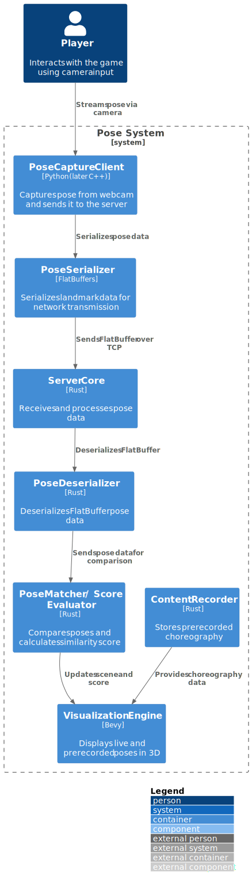

## Component Overview

The system is organized into the following main components:

- **Pose Controller**  
  - **Pose Capture & Inference**: Uses MediaPipe (Python, C++, or JS in browser) to detect human  
    pose landmarks from camera/video.  
  - **Pose Serializer & WebSocket Server**: Serializes landmark data via FlatBuffers (`schemas/pose.fbs`)  
    and streams binary frames over a WebSocket endpoint (`/stream`).  
  - **Score Request Handler**: Listens for FlatBuffers “ScoreRequest” messages from the game client  
    and responds with “ScoreUpdate” messages over the same WebSocket.

- **Game Client (Bevy)**  
  - **WebSocket Client & Pose Deserializer**: Connects to the controller’s WebSocket server, receives  
    FlatBuffers “PoseFrame” messages, and deserializes them into native Rust structures.  
  - **Pose Matcher / Score Evaluator**: Compares incoming live pose data against prerecorded  
    choreography (provided by Content Recorder) to compute a similarity score.  
  - **Visualization Engine (Bevy)**: Renders both live and prerecorded poses side-by-side in a 3D game  
    environment, updating with real-time feedback based on similarity scores.  
  - **Score Request Sender**: When the game logic needs a new score (e.g., at specific intervals),  
    serializes a FlatBuffers “ScoreRequest” and sends it over WebSocket.

- **Content Recorder**  
  - Captures prerecorded choreography by running the Pose Controller in a record mode or using a  
    separate recorder client that streams to a local storage service.  
  - Stores pose sequences (FlatBuffers) for later replay and comparison by the Game Client.

- **Browser-Only Variant**  
  - **MediaPipe JS Inference**: Runs in-browser pose detection using `@mediapipe/pose` (WebAssembly).  
  - **WASM FlatBuffers Client**: Uses wasm-bindgen to link FlatBuffers deserialization to the game  
    logic compiled to WebAssembly (Rust + Bevy).  
  - **In-Page Visualization**: Embeds Bevy WASM rendering directly in a web page canvas.

### Component Diagram

The following diagram provides a high-level view of the core components and their
interactions in the system:

