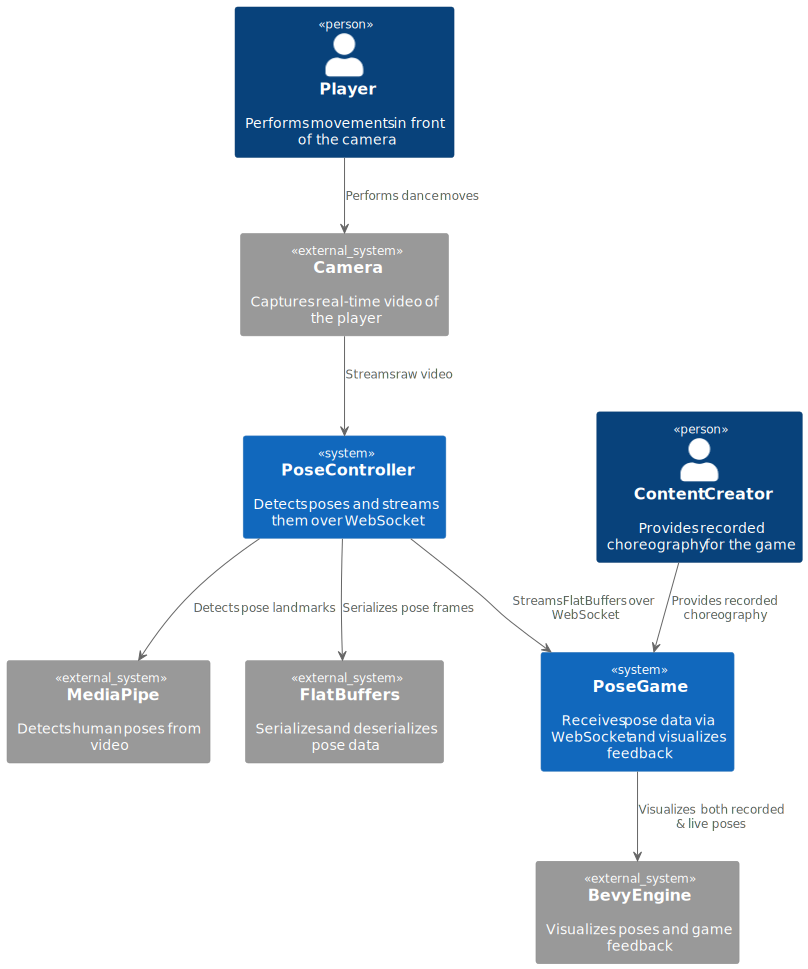

## System Context

The purpose of this project is to develop a game controlled entirely by a camera. Inspired by games like
“Just Dance,” the core idea is to offer an engaging, movement-based experience where players try to mirror
a prerecorded choreography as accurately as possible.

- Choreography is captured in advance using the same pose-detection system as the player.  
- Both recorded and live poses are visualized in real time, providing immediate feedback.  
- The game compares live player input against recorded content to compute a matching score for scoring,
  progression, or feedback.

While dance is the primary use case, the system is designed to be extensible to other movement-based
experiences (e.g., boxing, fitness routines, motion-based rehabilitation). We aim to modularize motion
input, real-time detection, and motion matching so that the same core can support multiple front ends or
devices.

### Target Environments

1. **Development Environment (Local)**  
   - Standard webcam for pose capture.  
   - Desktop or laptop capable of running MediaPipe and Bevy in parallel.  
   - Local communication between the pose client and the Rust-based game (initially TCP, later
     WebSockets).

2. **Production or Extended Setups**  
   - Hardware placement (camera height, lighting) and platform capabilities (CPU/GPU) can influence
     performance.  
   - Mobile or embedded devices may act as the controller (e.g., Android tablet, Raspberry Pi).  
   - Browser-only variant (WASM) where both inference (MediaPipe JS) and rendering (Bevy WASM) occur
     client-side, communicating over WebSockets.

### System Context Diagram

### Environment

- **Development**  
  - A standard webcam streams live pose data.  
  - MediaPipe runs on the same machine as the Bevy game.  
  - The controller and game communicate locally (now over WebSockets).

- **Production**  
  - Controller could run on a separate device (desktop, mobile, or embedded).  
  - Browser clients connect via WSS (TLS) for in-browser inference and rendering.  
  - Network considerations (firewalls, NAT) influence how WebSocket connections are established.  

